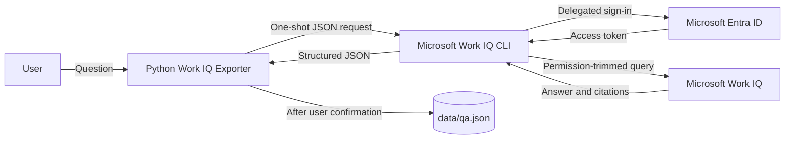

# Work IQ Local Exporter

A Windows command-line application that asks Microsoft Work IQ a human-directed question and optionally stores the question, synthesized answer, and citations in a local JSON file.

This application does not export raw email, Teams, calendar, OneDrive, or SharePoint records. It must not be used for unattended queries or bulk extraction.

## Architecture

The local Python exporter receives a human-entered question and invokes Microsoft's official Work IQ CLI, which authenticates the configured user through Microsoft Entra ID and sends the request to Work IQ. Work IQ reasons over Microsoft 365 content using that user's existing permissions and returns a synthesized answer; the exporter displays it and, only after confirmation, writes the question, complete answer, citations, and conversation metadata to `data/qa.json`. The default `official-cli` provider uses Microsoft's approved Entra application, so this project does not need its own app registration. A custom public-client Entra app with delegated `WorkIQAgent.Ask` permission and admin consent is required only when using the optional `direct` A2A provider.



## Prerequisites

- Python 3.11 or newer.
- A Microsoft 365 tenant enabled for [Work IQ](https://learn.microsoft.com/en-us/microsoft-365/copilot/extensibility/work-iq/enable-work-iq).
- A user assigned to the Work IQ usage-based billing plan.
- Administrative consent for the official Work IQ application in the Microsoft 365 tenant.
- For the optional `direct` provider only: a public-client Entra application with delegated `WorkIQAgent.Ask` and admin consent.

Follow the [Work IQ A2A quickstart](https://learn.microsoft.com/en-us/microsoft-365/copilot/extensibility/work-iq/a2a/quickstart) only when configuring the optional direct provider and its desktop redirect URIs.

## Install

```powershell
python -m venv .venv
.\.venv\Scripts\Activate.ps1
python -m pip install -e ".[dev]"
```

For a corporate tenant, install the official Work IQ CLI and accept its EULA yourself:

```powershell
npm install -g @microsoft/workiq
workiq accept-eula
workiq auth login --account you@example.com
```

Set the non-secret application configuration:

```powershell
$env:WORKIQ_TENANT_ID = "your-tenant-id"
$env:WORKIQ_PROVIDER = "official-cli"
$env:WORKIQ_ACCOUNT = "you@example.com"
$env:WORKIQ_TIME_ZONE = "America/Los_Angeles"
```

The `official-cli` provider uses Microsoft's supported Work IQ client registration and is recommended for corporate tenants. To use the direct A2A provider instead, set `WORKIQ_PROVIDER=direct` and `WORKIQ_CLIENT_ID` to your public-client app registration ID.

`WORKIQ_TIME_ZONE` must be the user's IANA time zone. Optional settings are `WORKIQ_RETENTION_HOURS` (default `24`) and `WORKIQ_DATA_PATH`. For this project, set the data path to `C:\Users\eweigel\PythonDemos\WorkIQ\data\qa.json` to keep runtime data in the local WorkIQ folder. The `data` directory is excluded from Git.

On Windows, the application also reads persisted user values from `HKCU\Environment`. This allows it to use settings created with `[Environment]::SetEnvironmentVariable(..., 'User')` even when VS Code was already running and a new integrated terminal inherited its older environment.

## Use

```powershell
python -m workiq_exporter ask "Summarize my meetings today"
python -m workiq_exporter list
python -m workiq_exporter show ITEM_ID
python -m workiq_exporter delete ITEM_ID
python -m workiq_exporter purge
python -m workiq_exporter purge --all
```

The `ask` command displays the Work IQ result and asks before saving both the question and complete answer. The `list` command shows short previews of both fields, while `show ITEM_ID` prints the complete saved pair. `purge --all` deletes all locally stored pairs and does not require sign-in.

## Local Data

The JSON file contains sensitive Microsoft 365-derived text. The application removes inherited permissions from its data directory and grants access to the current Windows user, System, and local Administrators. Keep it outside OneDrive and other synchronized folders, and use BitLocker or equivalent full-disk encryption. Access tokens are held in memory and are never written to the JSON file.

Saved entries expire after the configured retention period and are removed during repository operations. Revoke application consent at [My Apps](https://myapps.microsoft.com), then run `purge --all` to remove local content.

## Test

```powershell
python -m pytest -q
```